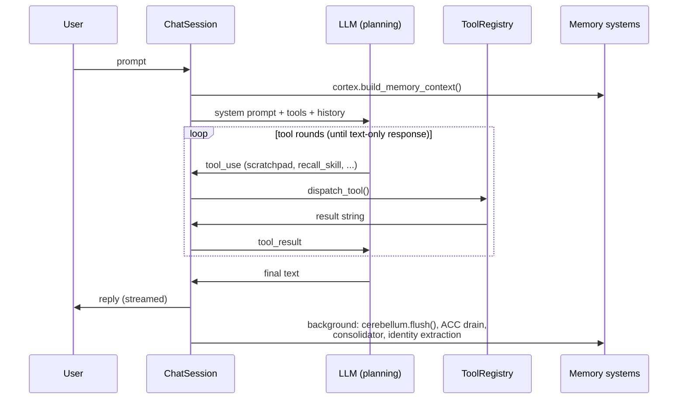

# Architecture overview

Anton has a brain-inspired architecture. The user docs deliberately use plain names
(memory, lessons, skills); in the contributor docs we use the real module names —
hippocampus, cortex, cerebellum, ACC, striatum — because the code does. If you want
the full rosetta stone, start with [Brain mapping](/developer/brain-mapping).


At the highest level there are three layers:

- **The executive (orchestrator)** — the chat loop plus `ChatSession`. It plans,
  picks tools, monitors progress, and decides when to stop.
- **Scratchpads (working memory)** — isolated Python reasoning environments where
  most actual work happens. See [Scratchpad runtime](/developer/scratchpad-runtime).
- **Long-term stores** — the experience store (episodic memory), the declarative
  memory files (engrams), the cerebellum/ACC error-learning loop, and the skill
  library (procedural memory).

```
  ┌────────────────────────────────────────────────────┐
  │              EXECUTIVE (the orchestrator)          │
  │                                                    │
  │  On new problem:                                   │
  │    1. Check SKILL LIBRARY → match?                 │
  │       YES → recall_skill(label) → load procedure   │
  │       NO  → open fresh scratchpad                  │
  │    2. Monitor scratchpad progress                  │
  │    3. Detect stuck/failure → pivot strategy        │
  │    4. On success → record to experience store      │
  └────────────┬────────────────────↑──────────────────┘
               │ spawns & monitors  │
               ▼                    │
  ┌──────────────────────────────────────────────────────┐
  │              SCRATCHPADS (working memory)            │
  │                                                      │
  │  Each scratchpad is:                                 │
  │  - An isolated reasoning environment (its own venv)  │
  │  - A chain-of-thought trace (code + observations)    │
  │  - Has a goal, constraints, and a budget             │
  │  - Can request sub-scratchpads (decomposition)       │
  │                                                      │
  │  Every cell execution fires pre/post hooks observed  │
  │  by the CEREBELLUM (post-mortem error learning).     │
  └──────┬──────────────┬───────────────────┬────────────┘
         │              │                   │
         │ on success   │ on cell errors    │ on success
         ▼              ▼                   ▼
  ┌────────────┐  ┌──────────────┐  ┌─────────────────────┐
  │ EXPERIENCE │  │  CEREBELLUM  │  │   SKILL LIBRARY     │
  │   STORE    │  │              │  │                     │
  │ (hipp.)    │  │ Buffers bad  │  │ /skill save → LLM   │
  │            │  │ cells, runs  │  │ drafts a procedure  │
  │ Episodes — │  │ post-mortem  │  │ with label + name + │
  │ JSONL log  │  │ via LLM,     │  │ when_to_use +       │
  │ of every   │  │ encodes new  │  │ declarative_md.     │
  │ turn.      │  │ lessons via  │  │                     │
  │            │  │ Cortex.      │  │ Future turns recall │
  │ Recall via │  │              │  │ the procedure via   │
  │ `recall`   │  │ Lessons feed │  │ recall_skill tool.  │
  │ tool.      │  │ next code    │  │                     │
  │            │  │ generation   │  │ Stored at           │
  │            │  │ (procedural  │  │ ~/.anton/skills/    │
  │            │  │ priming).    │  │   <label>/          │
  └────────────┘  └──────────────┘  └─────────────────────┘
```

The brain analog: the executive (PFC) plans and delegates to working memory
(scratchpads), which can pull on procedural memory (striatum/skills) for known
recipes and on declarative memory (hippocampus/cortex/engrams) for facts. The
cerebellum runs in parallel with continued action — it never blocks the agent,
it just refines future cells through supervised error learning.

## Entry points

```
anton (console script, pyproject.toml)
  → anton/cli.py            Typer app: setup wizard, flags, terms, deps
    → anton/chat.py         _chat_loop(): wires Cortex, EpisodicMemory,
                            reconsolidation, DS_* env injection, slash commands
      → anton/core/session.py   ChatSession: the turn loop runtime —
                                system prompt assembly, tool registry,
                                streaming, ACC emit sites, end-of-turn flushes
```

`anton/chat.py` owns the interactive loop and one-time startup wiring
(memory directories, vault credential injection, history store). The
`ChatSession` class in `anton/core/session.py` owns everything per-turn:
building the system prompt, registering tools, streaming LLM responses,
dispatching tool calls, and scheduling background learning tasks.

## How a turn flows



The key property: **all learning is post-hoc and fire-and-forget**. The user
gets their reply first; cerebellum diffs, ACC detection, consolidation, and
identity extraction all run as background `asyncio` tasks after the turn ends.

## Package tour

| Package | What lives there | Deep dive |
|---|---|---|
| `anton/core/memory/` | Brain-mapped memory: `hippocampus.py`, `cortex.py`, `episodes.py`, `consolidator.py`, `cerebellum.py`, `acc.py`, `skills.py`, `base.py` (Engram) | [Memory systems](/developer/memory-systems), [Error learning](/developer/cerebellum-and-acc), [Skills internals](/developer/skills-internals) |
| `anton/memory/` | Legacy/orthogonal: reconsolidator (migration), history store, session store, `/memory` command handlers | [Memory systems](/developer/memory-systems) |
| `anton/core/llm/` | Provider abstraction, `LLMClient`, structured output, prompt builder, trace headers | [LLM dispatch](/developer/llm-dispatch) |
| `anton/core/tools/` | Tool definitions, dispatch, registry, web tools, `recall_skill` | [Tool system](/developer/tool-system), [Adding a tool](/developer/adding-a-tool) |
| `anton/core/backends/` | Scratchpad runtimes: local venv subprocess, remote HTTP, manager, boot script | [Scratchpad runtime](/developer/scratchpad-runtime) |
| `anton/core/datasources/` | `datasources.md` engine registry + the credential vault (`DS_*` env injection) | [Adding a data source](/developer/adding-a-datasource) |
| `anton/commands/` | Slash command handlers (`/skill`, `/connect`, `/setup`, ...) | [Skills internals](/developer/skills-internals) |

## Where to go next

- **Understand the naming** → [Brain mapping](/developer/brain-mapping)
- **Memory internals** → [Memory systems](/developer/memory-systems)
- **Error learning** → [Cerebellum & ACC](/developer/cerebellum-and-acc)
- **Add a capability** → [Adding a tool](/developer/adding-a-tool) or [Adding a data source](/developer/adding-a-datasource)
- **Ship it** → [Release & versioning](/developer/release-and-versioning) and [Contributing](/developer/contributing)
