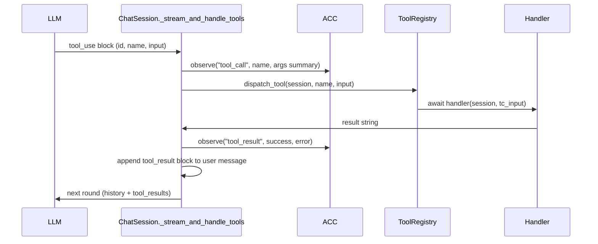

# Tool system

Tools are the LLM's only way to act. The machinery lives in `anton/core/tools/`:

| File | Role |
|---|---|
| `tool_defs.py` | The `ToolDef` dataclass + most built-in tool definitions |
| `tool_handlers.py` | The handler functions, including `handle_scratchpad` with observer firing |
| `registry.py` | `ToolRegistry` — registration + dispatch |
| `recall_skill.py` | The procedural-memory retrieval tool (definition + handler in one file) |
| `web_tools.py` | Fallback `web_search` / `web_fetch` handlers for providers without native web tools |

## `ToolDef`

```python
@dataclass
class ToolDef:
    name: str
    description: str
    input_schema: dict
    handler: Callable  # async (session, tc_input) -> str
    prompt: Optional[str] = None  # optional system-prompt fragment
```

`description` and `input_schema` are LLM-facing; `handler` and `prompt` are
internal. A handler is an async function taking the `ChatSession` and the
tool-call input dict, returning a result string (or, for vision tools like
`read_image`, a list of content blocks).

## `ToolRegistry`

A thin list with three jobs: `register_tool` (skips duplicates by name),
`dispatch_tool(session, tool_name, tc_input)` (find by name, await the
handler), and `dump()` (the LLM-facing schemas — name, description,
input_schema only).

## The built-in tool set

`ChatSession._build_core_tools()` (`anton/core/session.py`) registers tools
conditionally:

| Tool | Registered when | Handler |
|---|---|---|
| `scratchpad` | Always | `handle_scratchpad` — exec/view/reset/remove/dump/install |
| `read_image` | Always | `handle_read_image` — returns image content blocks |
| `memorize` | Cortex (or legacy self-awareness) present | `handle_memorize` → `cortex.encode()` |
| `recall` | Episodic memory enabled | `handle_recall` → `episodic.recall_formatted()` |
| `recall_skill` | Always (no-op without skills) | `handle_recall_skill` → `SkillStore.load()` + counter |
| `web_search` | Only when the provider does NOT execute it natively | `handle_web_search_fallback` |
| `web_fetch` | Only when the provider does NOT execute it natively | `handle_web_fetch_fallback` |
| `create_artifact`, `list_artifacts`, `open_artifact`, `set_artifact_primary` | A workspace is bound to the session | Artifact store handlers |

Notes:

- The scratchpad tool's description is enriched at registration time: the
  notable installed-packages line, plus `cortex.get_scratchpad_context()` —
  the "Lessons from past sessions" procedural-priming channel the cerebellum
  feeds (see [Memory systems](/developer/memory-systems)).
- Web tools: on Anthropic BYOK, OpenAI BYOK, and mdb.ai passthrough, the
  session computes `_native_web_tools` from the provider's capabilities and the
  fallback ToolDefs never enter the registry — the provider executes search/fetch
  server-side and the dispatch loop never sees a `tool_use` for them. Only
  generic openai-compatible endpoints get the handler-dispatched fallbacks.
  See [Web search](/connect/web-search) and [Web fetch](/connect/web-fetch).
- Extra tools can be passed into the session via `_extra_tools` (used by
  embedding hosts).

## How tools reach the LLM

`ChatSession._build_tools()` lazily populates the registry on first use and
returns `tool_registry.dump()`, which is passed as `tools=[...]` on every
`plan`/`plan_stream` call. When native web tools are active, their identifiers
are also passed via `native_web_tools` so the provider can attach its
server-side tool definitions.

## A tool result's round trip



Details that matter:

- **Malformed tool JSON** never reaches handlers: `ToolCall.parse_error` is set
  when streamed arguments couldn't be parsed, and the dispatcher short-circuits
  with a synthetic tool_result asking the LLM to re-emit the call — instead of
  running the handler with empty input.
- **Episodic logging**: each `tool_call` and `tool_result` is logged to episodic
  memory (truncated to 500/2000 chars).
- **ACC observation points**: `tool_call` is emitted at the top of the per-call
  loop; `tool_result` after the result text is finalized. Scratchpad calls get
  finer-grained events from inside `handle_scratchpad`
  (`scratchpad_call/result/killed/reset/empty_code`). `history_repair` and
  `cap_exhausted` are emitted from the session loop itself. See
  [Cerebellum & ACC](/developer/cerebellum-and-acc).
- **Round cap**: the loop runs until the LLM returns a text-only response or
  the tool-round cap is exhausted (which emits `cap_exhausted` and forces a
  wrap-up).
- **Observer firing**: only `handle_scratchpad` fires the pre/post-execute
  scratchpad observers; other tools have no observer surface.

## Adding your own

See [Adding a tool](/developer/adding-a-tool) for the step-by-step walkthrough —
and for the philosophy of when a new tool is warranted at all (usually it
isn't: the scratchpad covers most capabilities).
